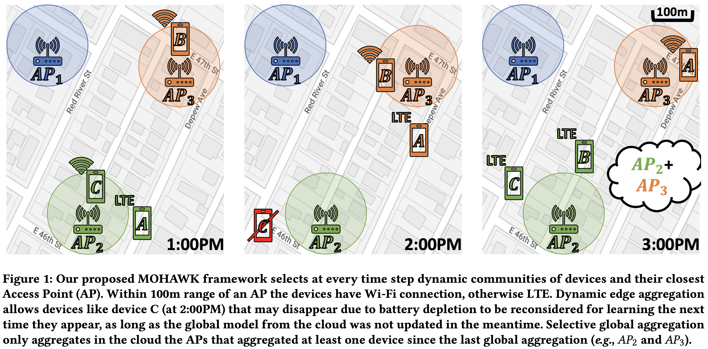

# [MOHAWK: Mobility and Heterogeneity-Aware Dynamic Community Selection for Hierarchical Federated Learning](https://dl.acm.org/doi/abs/10.1145/3576842.3582378) (IoTDI 2023) 
Allen-Jasmin Farcas, Myungjin Lee, Ramana Rao Kompella, Hugo Latapie, Gustavo De Veciana, Radu Marculescu

Contact: allen.farcas@utexas.edu

<div align="center">
    <a href="./">
        
    </a>
</div>

## 1. Prepare environment
```bash
conda create -n mohawk python==3.10
conda activate mohawk
pip3 install torch torchvision torchaudio --index-url https://download.pytorch.org/whl/cu118
pip install paramiko scp tqdm pandas
```

## 2. Prepare mobility data
Download the mobility dataset from [here](https://drive.google.com/file/d/1sFOMHPZOCiVKCVQAVubxyEApXWu-eU81/view?usp=share_link).
Unzip the downloaded file under the `mobility_data` folder such that you have the following structure:
```
mobility_data
--- data_prepare.py
--- mobility_utils.py
--- RVF_ATX_PID_HZ-2020-05.tsv
--- RVF_ATX_PID_HZ_Places_Lookup.tsv
```

Then, execute the following:
```bash
cd mobility_data
python data_prepare.py
```

## 3. Prepare datasets
Run `python generate_dataset.py` to create the local datasets for all users.

## 4. Change paths
In `utils.py` the function `get_hw_info` contains paths for the files. Change them accordingly. The username and 
password only really matter if you run experiments on real devices. If you use only simulation you can leave any 
placeholder text there, but the path for the files needs to be completed.

You need to match the `hw_type` from `get_hw_info(hw_type)` with `device_type` from `exp0.bash` and if the added path
is `home/user/MOHAWK/files` then in `exp0.bash` use `cloud_path="files"`.

## 5. Run experiments
Edit the experiment configuration `experiments/exp0.bash`. Check the simulation.py for more details on the parameters used.

Run `bash experiments/exp0.bash` to start the experiment

## Citation
```
@inproceedings{farcas2023mohawk,
  title={MOHAWK: Mobility and Heterogeneity-Aware Dynamic Community Selection for Hierarchical Federated Learning},
  author={Farcas, Allen-Jasmin and Lee, Myungjin and Kompella, Ramana Rao and Latapie, Hugo and De Veciana, Gustavo and Marculescu, Radu},
  booktitle={Proceedings of the 8th ACM/IEEE Conference on Internet of Things Design and Implementation},
  pages={249--261},
  year={2023}
}
```
